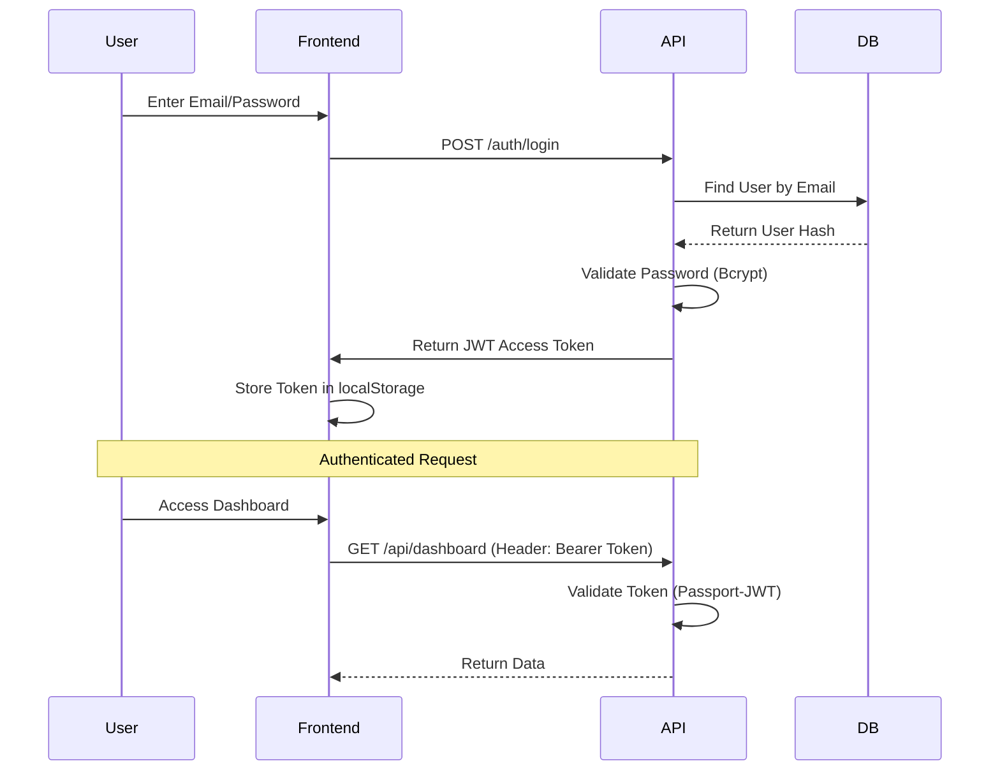

# Technical Specification Document

**Project**: Fintech Manager
**Version**: 1.1.0
**Status**: MVP Development

---

## 1. System Architecture

### 1.1 High-Level Architecture
The system follows a modular Monorepo structure managed by **TurboRepo**.
It is designed for local development with containerized infrastructure.

```mermaid
graph TD
    User((User))
    subgraph "Frontend Client (Port 5173)"
        Web[React Application]
    end
    
    subgraph "Backend API (Port 3000)"
        Nest[NestJS API]
        Auth[Auth Module]
        Prisma[Prisma ORM]
    end
    
    subgraph "Infrastructure (Docker)"
        DB[(PostgreSQL - Port 5432)]
    end

    User -->|HTTPS/Browser| Web
    Web -->|REST API (Axios)| Nest
    Nest -->|Guards| Auth
    Auth -->|JWT Strategy| Prisma
    Prisma -->|TCP| DB
```

### 1.2 Component Stack
| Component | Technology | Port | Description |
| :--- | :--- | :--- | :--- |
| **Frontend** | React + Vite + Tailwind | `5173` | Single Page Application (SPA) for UI. |
| **Backend** | NestJS (Node.js) | `3000` | REST API, Business Logic, Auth. |
| **Database** | PostgreSQL 15 | `5432` | Relational Data Store (Dockerized). |
| **ORM** | Prisma | - | Type-safe Database Access Layer. |

---

## 2. Authentication Flow

We use a **Stateless JWT (JSON Web Token)** strategy.

### 2.1 Sequence Diagram


### 2.2 detailed Implementation Steps
1.  **Registration**: User submits credentials to `POST /auth/register`. API hashes password (bcrypt salt round 10) and creates `User` record.
2.  **Login**: User submits credentials to `POST /auth/login`. API verifies hash, generates signed JWT (expires in 1h), and returns it.
3.  **Storage**: Frontend receives JWT and stores it in browser `localStorage`.
4.  **Interception**: Axios interceptor (`api.ts`) automatically attaches `Authorization: Bearer <token>` to every subsequent request.
5.  **Validation**: NestJS `JwtStrategy` intercepts requests, decodes token, matches `sub` (User ID) to database, and attaches user object to `req.user`.

### 2.3 Request Lifecycle (Data Flow)
When you hit an API endpoint (e.g., `POST /auth/login`), data flows through these layers. Each layer has a specific responsibility:

1.  **Client (React)**: User clicks "Login". `api.ts` sends HTTP POST request.
    *   *Why?* Initiates the action and handles UI feedback.
2.  **Controller (`auth.controller.ts`)**: Receives the request.
    *   *Why?* It's the "Receptionist". It checks the URL (`/login`) and HTTP Method (`POST`), validates payload (`LoginDto`), and delegates work to the Service. **It contains NO business logic.**
3.  **Service (`auth.service.ts`)**: logic processing.
    *   *Why?* It's the "Brain". It hashes passwords, compares them, generates JWT tokens, and decides *what* to do. It doesn't know about HTTP or JSON, just data.
4.  **Data Access (`prisma.service.ts`)**: Database communication.
    *   *Why?* It's the "Librarian". It translates Service commands (e.g., `findUnique`) into SQL queries that the Database understands.
5.  **Database (PostgreSQL)**: Physical storage.
    *   *Why?* Persists the data (`User` table) so it survives server restarts.

**Return Trip**: The data (e.g., `User` object) flows back up: DB -> Prisma -> Service -> Controller -> Client.

---

## 3. Database Schema

The database is normalized to support polymorphic assets and a unified transaction log.

### 3.1 Primitives
*   **Enums**: `Role` (USER/ADMIN), `AssetType` (LOAN/STOCK/etc), `TransactionType` (BUY/SELL/etc).

### 3.2 Core Models
*   **User**: Identity management.
    *   `id` (UUID), `email` (Unique), `passwordHash`, `role`.
*   **Asset**: Abstract parent entity for all holdings.
    *   `id`, `userId`, `type`, `name`.
*   **Transaction**: Global ledger for ALL financial events.
    *   `id`, `userId`, `assetId`, `amount`, `type`, `date`.

---

## 4. API Specification

All API responses follow a standard JSON format.

### 4.1 Auth Module (`/auth`)
| Method | Endpoint | Description | Payload | Response |
| :--- | :--- | :--- | :--- | :--- |
| `POST` | `/auth/register` | Create Account | `{ email, password }` | `{ accessToken: string }` |
| `POST` | `/auth/login` | Sign In | `{ email, password }` | `{ accessToken: string }` |

### 4.2 Health Module (`/health`)
| Method | Endpoint | Description | Response |
| :--- | :--- | :--- | :--- |
| `GET` | `/health` | System Status | `{ status: "ok", timestamp: "..." }` |

---

## 5. Security Standards

1.  **Password Storage**: Bcrypt hashing.
2.  **Transport**: HTTPS (Production) / HTTP (Local).
3.  **CORS**: Configured to whitelist Frontend origin (`localhost:5173`).
4.  **Environment Variables**: Secrets (DB passwords, JWT keys) are strictly managed via `.env` files (git-ignored).
5.  **Route Protection**: `JwtAuthGuard` applied globally or per-controller.
